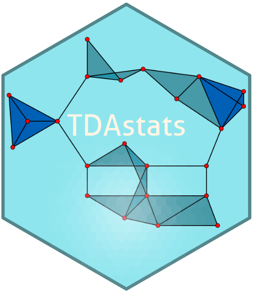

# TDAstats: R pipeline to compute persistent homology in topological data analysis 

[](https://travis-ci.org/rrrlw/TDAstats)
[](https://ci.appveyor.com/project/rrrlw/TDAstats)
[](https://codecov.io/github/rrrlw/TDAstats?branch=master)

[](https://www.gnu.org/licenses/gpl-3.0)
[](https://CRAN.R-project.org/package=TDAstats)
[](https://CRAN.R-project.org/package=TDAstats)

[](https://doi.org/10.21105/joss.00860)

## Overview

TDAstats is an R pipeline for topological data analysis, specifically, the
use of persistent homology in Vietoris-Rips simiplicial complexes to study the
shape of data.

## Installation

To install TDAstats, run the following R code:
```r
# install from CRAN
install.packages("TDAstats")

# install development version from GitHub
devtools::install_github("rrrlw/TDAstats")

# install development version with vignettes/tutorials
devtools::install_github("rrrlw/TDAstats", build_vignettes = TRUE)
```

## Sample code

The following sample code creates two synthetic datasets, and calculates and visualizes their persistent homology to showcase the use of TDAstats.

```r
# load TDAstats
library("TDAstats")

# point cloud: uniform random points in unit square (2-dimensional)
data1 <- cbind(runif(100), runif(100))

# point cloud: points distributed uniformly around circle (2-dimensional)
angles <- runif(100, 0, 2 * pi)
circ <- cbind(cos(angles), sin(angles))

# calculate persistent homology for both datasets
data1.hom <- calculate_homology(data1, dim = 1)
circ.hom <- calculate_homology(circ, dim = 1)

# visualize first dataset as persistence diagram
plot_persist(data1.hom)

# visualize second dataset as topological barcode
plot_barcode(circ.hom)
```

## Functionality

TDAstats has 3 primary goals:

1.  *Calculation of persistent homology*: the C++
[Ripser](https://github.com/Ripser/ripser)
project is a lightweight library for calculating persistent homology
that outpaces all of its competitors. Given the importance of computational
efficiency, TDAstats naturally uses Ripser behind the scenes for homology
calculations, using the Rcpp package to integrate the C++ code into an R
pipeline.

2.  *Statistical inference of persistent homology*: persistent homology can be
used in hypothesis testing to compare the topological structure of two point
clouds. TDAstats uses a permutation test in conjunction with the Wasserstein
metric for nonparametric statistical inference.

3.  *Visualization of persistent homology*: persistent homology is visualized
using two types of plots - persistence diagrams and topological barcodes.
TDAstats provides implementations of both plot types using the
[ggplot2](https://github.com/tidyverse/ggplot2)
framework. Having ggplot2 underlying the plots confers many advantages to the
user, including generation of publication-quality plots and customization using
the ggplot object returned by TDAstats.

## Contribute

To contribute to TDAstats, you can create issues for any bugs/suggestions on the [issues page](https://github.com/rrrlw/TDAstats/issues). You can also fork the TDAstats repository and create pull requests to add features you think will be useful for users.
